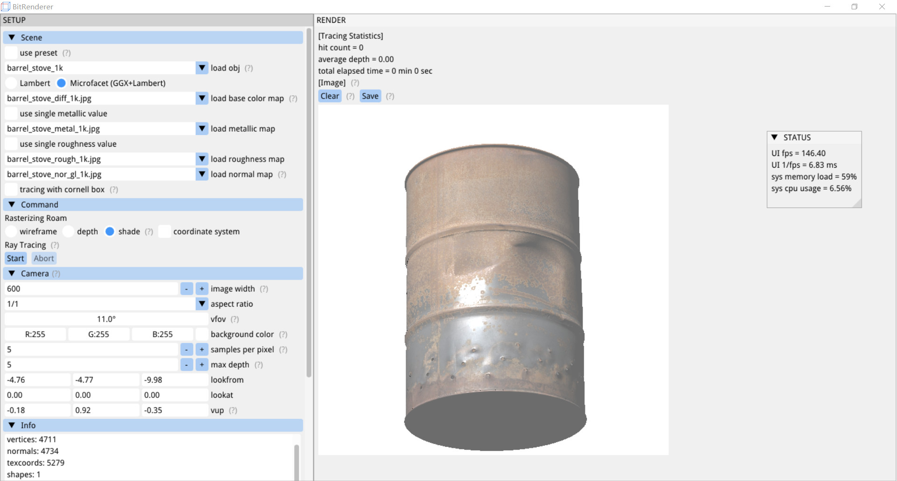
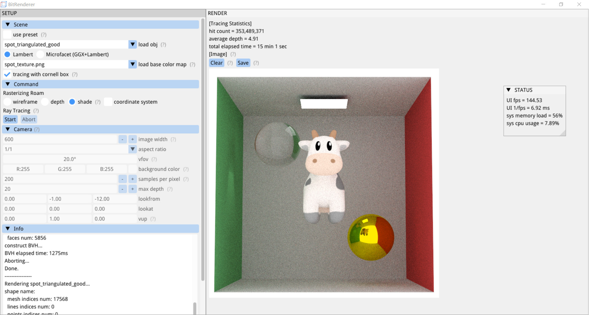

# BitRenderer

基于C++17的软件渲染器。

支持**光栅化**实时漫游和**光线追踪**离线渲染。

采用金属粗糙度工作流，实现了基于微表面的GGX镜面反射BRDF和Lambertian漫反射BRDF相结合的材质模型。

选择obj模型和贴图，在光栅化模式下进行漫游，有线框、深度、着色三种模式可选。漫游确定合适相机位置后，可开启光线追踪离线渲染当前场景，渲染过程实时显示。光追采用蒙特卡洛路径追踪及BVH加速，支持多重重要性采样。

## 使用说明

UI按3:7纵向划分为**SETUP**界面和**RENDER**界面（自适应窗口大小变化），另有悬浮的**STATUS**界面（可移动和折叠）。

> 将鼠标悬停在UI界面的各个`(?)`标志处可查看相关详细信息。

- SETUP界面

   - Scene区域

     use preset复选框：勾选时显示load preset下拉框，未勾选时显示load obj下拉框及相关设置。默认未勾选。

     - load preset下拉框：选择预置场景。预置场景的几何表示为数学形式，无光栅化。

     - load obj下拉框：下载obj文件并置于`./BitRenderer/load/`文件夹（或其任意子文件夹）下，软件会在此处自动列出以供选择。

       Lambert选项 / Microfacet (GGX+Lambert)选项：选择材质类型。

       load **base color** map / load **metallic** map / load **roughness** map / load **normal** map下拉框：下载贴图（JPG, PNG, TGA, BMP, PSD, GIF, HDR, PIC）并置于`./BitRenderer/load/`文件夹（或其任意子文件夹）下，软件会在此处自动列出以供选择。法线贴图使用OpenGL标准。
       
       use single metallic value / use single roughness value复选框：勾选时使用单一值而不是贴图。
       
       tracing with cornell box复选框：勾选后光追时使用康奈尔盒包围obj，将自动设置相机至合适位置。
       

   - Command区域

     Rasterizing Roam配置：可在**wireframe**、**depth**、**shade**三个光栅化模式中选择其一，并选择是否显示坐标系。

     Ray Tracing配置：Start按钮开始光追，Abort按钮中止光追。

   - Camera区域

     仅光栅化时可与此区域UI交互。

     image width编辑框：编辑图像宽度。

     aspect ratio下拉框：选择宽高比，有1/1、4/3、3/2、16/9、2/1可选。

     vfov编辑框：编辑垂直视场角。可拖动以快速编辑。

     background color颜色编辑框：编辑背景颜色。可点击RGB后的颜色方块打开快速编辑界面。

     samples per pixel编辑框：编辑光追的每像素采样数。

     max depth编辑框：编辑光追的最大弹射深度。

     lookfrom、lookat、vup编辑框：显示及编辑相机的原点、注视点、向上方向。

   - Info区域

     打印程序运行信息。

- RENDER界面

   - Tracing Statistics区域

     - hit count：显示光追总击中（弹射）次数。

     - average depth：显示光追平均击中（弹射）次数。

     - total elapsed time：显示光追总耗时（加载obj用时+构建BVH用时+渲染用时）。

   - Image区域

     - Clear按钮：清除光追结果并重新开始光栅化。
     - Save按钮：保存当前渲染结果（光栅化或光追）至`./BitRenderer/output/`文件夹。

     图像实时显示当前渲染结果（光追过程中和光追结果未清除时显示光追图像，其它情况下显示光栅化图像）。

     **点击图像进行键鼠交互，按ESC退出交互：**

     - WS/AD/QE：前后/左右/上下移动相机

     - 鼠标中键：缩放fov

     -  鼠标左键：围绕当前观察点（随相机移动变化）转动视角（第三人称）

     - 鼠标右键：自身转动视角（第一人称）
   
     仅光栅化时可键鼠交互。

- STATUS界面

   实时显示状态信息：

   - UI fps：当前UI帧率。（UI后端为Win32+DirectX 12）

   - UI 1/fps：当前UI帧率的倒数，单位为毫秒。

   - sys memory load：系统内存负载，单位为百分比。

   - sys cpu usage：系统cpu占用率（每300毫秒统计一次），单位为百分比。

## 三方库

[nothings/stb](https://github.com/nothings/stb)：图片读写。

[ocornut/imgui](https://github.com/ocornut/imgui)：UI，后端使用Win32+DirectX 12。

[tinyobjloader/tinyobjloader](https://github.com/tinyobjloader/tinyobjloader)：obj加载。

## 参考资料

[ssloy/tinyraytracer](https://github.com/ssloy/tinyraytracer)

[ssloy/tinyrenderer](https://github.com/ssloy/tinyrenderer)

[GAMES101](https://sites.cs.ucsb.edu/~lingqi/teaching/games101.html)

[Ray Tracing in One Weekend Series](https://raytracing.github.io/)

[Crash Course in BRDF Implementation](https://boksajak.github.io/blog/BRDF)

[Morgan McGuire's Computer Graphics Archive](https://casual-effects.com/data/)

## 相关问题

1. 本项目的源代码文件的编码格式为`Unicode (UTF-8无签名) -代码页65001`。中文windows操作系统下visual studio默认使用的编码格式为`简体中文(GB2312) -代码页936`，因此编译时可能因为中文注释导致换行符莫名被丢掉，从而导致各种编译报错。解决方案有两个：
   1. 在项目属性页 -> C/C++ -> 命令行中添加`/utf-8`来指定代码页。
   1. 将windows操作系统的默认编码改为UTF-8。

2. 关于[分层采样的问题](https://github.com/RayTracing/raytracing.github.io/issues/1370)我的解决方案是补上缺失的采样数。

